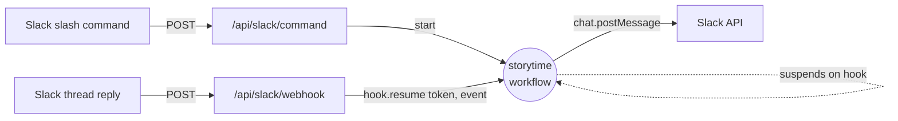

<style>
.slidev-layout h1,
.slidev-layout h2,
.slidev-layout h3,
.slidev-layout h4,
.slidev-layout h5,
.slidev-layout h6 {
  font-family: 'Geist', ui-sans-serif, system-ui, sans-serif !important;
  font-weight: 600;
  letter-spacing: -0.02em;
}
.slidev-layout {
  font-family: 'Geist', ui-sans-serif, system-ui, sans-serif;
}
code, pre, .shiki, .slidev-code {
  font-family: 'Geist Mono', ui-monospace, monospace !important;
}
</style>

<div class="flex flex-col items-center justify-center h-full gap-8">

<div class="flex items-center gap-6">
  
  <div class="text-5xl opacity-30 font-light">×</div>
  
</div>

<div class="text-center">
  <h1 class="!mb-2">Once Upon a Webhook</h1>
  <h2 class="opacity-80 !text-2xl !font-normal">Durable AI Agents with Workflow SDK</h2>
</div>

<div class="text-center opacity-60 max-w-2xl text-sm mt-4">
  How a Slack bot's distributed application logic<br/>
  can read like a local CLI script.
</div>

</div>

<!--
~60s. Land the thesis: Workflow SDK isn't just durability and retries — it's a
fundamentally different way to write distributed application logic. We're going
to prove it by porting a tiny CLI script to a multi-user Slack bot and changing
almost nothing.
-->

---
layout: image-right
image: /storytime-slack.png
backgroundSize: contain
---

# The product

A collaborative storytime bot for Slack.

- `/storytime` kicks off a story in any channel
- The AI writes an opening, then **invites the thread to continue**
- Anyone in the thread can add a piece — the AI weaves it in
- After a few turns the AI ends the story and generates a **storyboard image**

<v-clicks>

This is a **stateful, multi-turn, multi-user, long-lived** interaction.

It can sit idle for minutes or hours waiting for the next reply.

</v-clicks>

<!--
~60s. Set the stage. Emphasize "long-lived" and "multi-user". The interaction
naturally spans many HTTP requests and lots of wall-clock time.
-->

---
layout: default
---

# I started here: a local CLI prototype

````md magic-move {lines: false}
```ts {*|1-2|4|12-27|14}
// local.ts — the original prototype
import { createReadlineIterator } from "./readline.js";
import { generateText, Output } from "ai";

const userInput = createReadlineIterator("Enter your story piece: ");

const messages = [
  { role: "system", content: SYSTEM_PROMPT(themes) },
  { role: "user", content: "Let's start a new story." },
];

let finalStory = "";

for await (const data of userInput) {
  messages.push({ role: "user", content: data.text });

  const result = await generateText({
    model,
    messages,
    experimental_output: Output.object({ schema: StorytimeSchema }),
  });

  messages.push({ role: "assistant", content: result.text });

  if (result.experimental_output?.done) {
    finalStory = result.experimental_output.story;
    break;
  }
}
```
````

<div v-click class="mt-4 text-sm opacity-80">
A single <code>async</code> function. State lives in local variables. Input is just an
async iterator we <code>for await</code> over. <strong>This is the natural shape of the
program.</strong>
</div>

<!--
~75s. Walk through the loop. Highlight that it's just `await rl.question(...)`
inside a `while`. The whole story state — message history, finalStory — is a
local variable. This is how anyone would prototype the logic.
-->

---
layout: default
---

# Now port it to Slack...

In Slack, "user input" is no longer a `readline`. It arrives as **separate HTTP requests**:

<v-clicks>

- `POST /api/slack/command` — the slash command starts the story
- `POST /api/slack/webhook` — *each* thread reply is its own webhook
- The `while` loop now spans **minutes or hours**, across cold starts and regions
- Conversation history must survive between requests
- Replies must route to the right ongoing story

</v-clicks>

<v-click>

<div class="mt-6 p-4 border border-red-400/40 rounded-lg bg-red-500/5">

**The traditional answer:** queue + KV store + a hand-rolled state machine, idempotency keys, retry wrappers, dead-letter handling, message-history serialization on every turn.

The straight-line program turns into a distributed system.

</div>

</v-click>

<!--
~60s. This is the slide where the audience nods along — they've all written
this distributed glue. Make the pain visceral. We're about to show that none of
that has to exist.
-->

---
layout: default
---

<div class="flex items-center gap-4 mb-2">
  
  <h1 class="!m-0">Workflow SDK + the Hook primitive</h1>
</div>

<div class="grid grid-cols-2 gap-8 mt-8">

<div v-click>

### `"use workflow"`

```ts
async function storytime(...) {
  "use workflow";
  // ...regular async code
}
```

A normal async function whose execution is **durable and resumable**.<br>
Crashes, redeploys, idle hours — it picks up exactly where it left off.

</div>

<div v-click>

### `defineHook`

```ts
const hook = defineHook({ schema });

// inside the workflow:
for await (const event of hook.create({ token })) { ... }

// from anywhere else:
await hook.resume(token, payload);
```

A typed **suspension point**. The workflow pauses until something — an HTTP route, a cron, another workflow — calls `resume()`.

</div>

</div>

<div v-click class="mt-10 text-center text-xl opacity-90">
A hook is <code>readline.question</code> for distributed systems.
</div>

<!--
~75s. Only "primer" slide. Two concepts: durable async function, and a typed
suspension point you can resume from anywhere by token. The closing line is the
mental model — that's all I want them to leave with.
-->

---
layout: default
---

# Architecture

<div class="flex justify-center">



</div>

<div class="mt-6 grid grid-cols-2 gap-6">

<div v-click>

**What's NOT in this diagram:**

- ❌ No queue
- ❌ No KV / Redis / database
- ❌ No state machine
- ❌ No retry wrapper
- ❌ No idempotency table

</div>

<div v-click>

**Why:**

The workflow function **is** the state.<br>
The hook **is** the queue.<br>
The token **is** the routing key.

<div class="mt-3 text-xs opacity-60 font-mono">
// workflows/create.ts:8<br>
// Look ma no queues or kv!
</div>

</div>

</div>

<!--
~60s. Walk the diagram. Slash command starts the workflow. Workflow suspends
on the hook. Webhook route resumes the hook by token. Punchline: the things
NOT in the diagram are the point.
-->

---
layout: default
---

# The port, one click at a time

````md magic-move {lines: true}
```ts
// 1. Where we started — local CLI
import { createReadlineIterator } from "./readline.js";
import { generateText, Output } from "ai";

const userInput = createReadlineIterator("Enter your story piece: ");

const messages = [
  { role: "system", content: SYSTEM_PROMPT(themes) },
  { role: "user", content: "Let's start a new story." },
];

let finalStory = "";

for await (const data of userInput) {
  messages.push({ role: "user", content: data.text });

  const result = await generateText({
    model,
    messages,
    experimental_output: Output.object({ schema: StorytimeSchema }),
  });

  messages.push({ role: "assistant", content: result.text });

  if (result.experimental_output?.done) {
    finalStory = result.experimental_output.story;
    break;
  }
}
```

```ts
// 2. Swap one async iterator for another — same loop body
import { defineHook } from "workflow";
import { z } from "zod";

export const slackMessageHook = defineHook({
  schema: z.object({ text: z.string(), ts: z.string() }),
});

const userInput = slackMessageHook.create({
  token: `slack-message-webhook:${channelId}:${ts}`,
});

const messages = [
  { role: "system", content: SYSTEM_PROMPT(themes) },
  { role: "user", content: "Let's start a new story." },
];

let finalStory = "";

for await (const data of userInput) {
  messages.push({ role: "user", content: data.text });

  const result = await generateText({
    model,
    messages,
    experimental_output: Output.object({ schema: StorytimeSchema }),
  });

  messages.push({ role: "assistant", content: result.text });

  if (result.experimental_output?.done) {
    finalStory = result.experimental_output.story;
    break;
  }
}
```

```ts
// 3. One directive turns it durable — done.
import { defineHook } from "workflow";
import { z } from "zod";

export const slackMessageHook = defineHook({
  schema: z.object({ text: z.string(), ts: z.string() }),
});

export async function storytime(channelId: string, ts: string) {
  "use workflow";

  const userInput = slackMessageHook.create({
    token: `slack-message-webhook:${channelId}:${ts}`,
  });

  const messages = [
    { role: "system", content: SYSTEM_PROMPT(themes) },
    { role: "user", content: "Let's start a new story." },
  ];

  let finalStory = "";

  for await (const data of userInput) {
    messages.push({ role: "user", content: data.text });

    const result = await generateText({ model, messages, /* ... */ });
    messages.push({ role: "assistant", content: result.text });

    if (result.experimental_output?.done) {
      finalStory = result.experimental_output.story;
      break;
    }
  }
}
```
````

<div v-click="3" class="absolute bottom-6 right-8 text-sm opacity-80 max-w-md text-right">
Same <code>for await</code>. Same <code>userInput</code> variable. Same loop body.<br>
<strong>The input mechanism changed. The application logic did not.</strong>
</div>

<!--
~120s. THE money slide. Click through:
1. Local CLI baseline — `createReadlineIterator()` yields `{ text }`, `for await`
   over it. Note that `userInput` is just an async iterator.
2. Swap `createReadlineIterator()` for `slackMessageHook.create({ token })` —
   ALSO an async iterator that yields `{ text }`. The variable name and the
   entire loop body are byte-identical. The token routes the right reply to
   the right ongoing story.
3. Wrap it in `async function storytime() { "use workflow"; }` — that one
   directive turns the whole thing into a durable, distributed program.
   Crashes, redeploys, idle hours: doesn't matter.

End on: input mechanism changed, application logic did not.
-->

---
layout: default
---

# How input gets in

The webhook handler is **boring on purpose** — it just forwards the event.

```ts {all|7-8|all}
// app/api/slack/webhook/route.ts
import { slackMessageHook } from "@/workflows/create";

export async function POST(req: Request) {
  const body = await req.json();
  const { channel, thread_ts, text, ts } = body.event;

  const token = `slack-message-webhook:${channel}:${thread_ts}`;
  await slackMessageHook.resume(token, { text, ts });

  return new Response("OK");
}
```

<div v-click class="mt-6">

- The token is just `channel:thread_ts` — Slack already gives us a unique routing key.
- `resume()` finds the suspended workflow and delivers the payload to its `for await`.
- All business logic — message history, AI calls, "is the story done?" — lives **in the workflow**, not here.

</div>

<!--
~45s. The other half of the picture. The webhook is dumb on purpose. No state,
no logic — just route the event by token. This is the same pattern for any
external trigger: cron, human approval, another workflow, an email reply.
-->

---
layout: center
class: text-center
---

# Takeaways

<div class="grid grid-cols-1 gap-6 mt-8 max-w-3xl mx-auto text-left">

<div v-click class="p-5 border border-cyan-400/30 rounded-lg bg-cyan-500/5">
<strong class="text-cyan-300">Workflow SDK ≠ just durability.</strong><br>
Retries, resumes, and crash-recovery are table stakes. The real product is the <strong>programming model</strong>.
</div>

<div v-click class="p-5 border border-purple-400/30 rounded-lg bg-purple-500/5">
<strong class="text-purple-300">Hooks turn distributed events into local <code>await</code>s.</strong><br>
Webhooks, cron, human approvals, sibling workflows — all the same shape.
</div>

<div v-click class="p-5 border border-amber-400/30 rounded-lg bg-amber-500/5">
<strong class="text-amber-300">The local prototype <em>was</em> the design.</strong><br>
Porting was a diff, not a rewrite. The flow of execution still reads top-to-bottom.
</div>

</div>

<div v-click class="mt-10 text-2xl">
🎬 <strong>Demo time</strong> — <code>/storytime -t Pirates -t Space</code>
</div>

<!--
~60s. Land the three takeaways. Then switch out of slides into Slack and run
the demo. If demo gods are kind, the audience just watched the code on screen
literally execute against a real Slack thread.
-->
